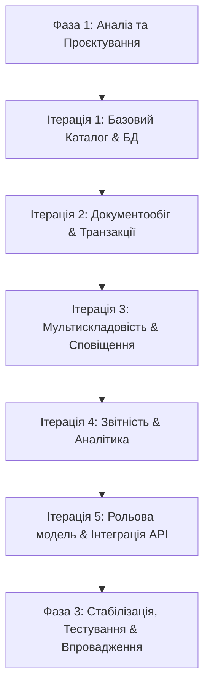

# Міністерство освіти і науки України
# Звіт з лабораторної роботи №1
**З дисципліни:** «Основи програмної інженерії» (ОПІ)  
**Тема:** Створення технічного завдання для розробки ПЗ  
**Варіант №11:** Система управління запасами (Inventory Management System)  

---

## МЕТА
Формування практичних навичок проведення аналізу предметної області та розробки технічного завдання на розробку програмного забезпечення.

---

## ЗАВДАННЯ 1. АНАЛІЗ ПРЕДМЕТНОЇ ОБЛАСТІ ТА ОБҐРУНТУВАННЯ АКТУАЛЬНОСТІ

### 1.1. Опис предметної області
**Система управління запасами (Inventory Management System, IMS)** є ключовою складовою сучасної логістики, торгівлі (e-commerce та ритейлу), виробництва та дистрибуції. Предметна область охоплює процеси контролю, обліку та оптимізації матеріальних активів організації від моменту їх закупівлі у постачальників до моменту реалізації кінцевому споживачу або використання у виробничому циклі.

Основні об'єкти предметної області:
- **Товарні позиції (SKU - Stock Keeping Unit):** картки товарів з унікальними ідентифікаторами (штрих-коди, артикули), описом, категоріями та характеристиками.
- **Склади та комірки зберігання:** фізичні локації, де розміщуються товари.
- **Постачальники:** контрагенти, що забезпечують надходження товарів.
- **Транзакції руху (документи):** прибуткові накладні, видаткові накладні, акти списання, документи внутрішнього переміщення.
- **Запаси (Stock):** поточні залишки товарів на складах у кількісному та грошовому вираженні.

### 1.2. Ключові бізнес-процеси
1. **Управління постачанням (Procurement):** формування замовлень постачальникам на основі прогнозування попиту або досягнення мінімальних залишків (Reorder Point).
2. **Оприбуткування товарів (Stock-In / Receiving):** приймання продукції на склад, перевірка відповідності супровідним документам, маркування штрих-кодами та розміщення у зонах зберігання.
3. **Адресне зберігання та переміщення (Storage & Internal Transfer):** облік точного розташування товарів на складі, переміщення між зонами (наприклад, із зони тривалого зберігання до зони комплектування).
4. **Резервування та відвантаження (Sales & Stock-Out):** списання запасів при продажу товарів, резервування під замовлення покупців.
5. **Інвентаризація (Inventory Auditing):** періодичний фізичний перерахунок залишків для виявлення розбіжностей (нестачі, надлишки, пересортиця), списання пошкодженого або протермінованого товару.

### 1.3. Обґрунтування актуальності розробки
У сучасних умовах високої конкуренції та стрімкого розвитку електронної комерції ефективність управління запасами безпосередньо впливає на рентабельність бізнесу. Ведення обліку в ручному режимі (на папері чи у простих таблицях Excel) призводить до критичних помилок:
* **Нестача товарів (Stockouts):** коли популярний товар закінчується, компанія втрачає продажі та лояльність клієнтів.
* **Надлишок товарів (Overstocking):** «заморожування» оборотного капіталу в надлишкових запасах, які псуються, морально застарівають або потребують додаткових витрат на зберігання.
* **Людський фактор:** помилки при ручному введенні даних, пересортиця, втрата документів.

**Актуальність розробки спеціалізованого ПЗ** зумовлена наступними перевагами для підприємства:
1. **Оптимізація витрат (Cost Reduction):** зниження витрат на зберігання за рахунок точного розрахунку страхових запасів (Safety Stock) та впровадження алгоритмів автоматичного дозамовлення.
2. **Моніторинг у реальному часі (Real-time Visibility):** миттєвий доступ до інформації про наявність товарів на будь-якому складі компанії для менеджерів, логістів та клієнтів (через API інтеграцію з веб-сайтом).
3. **Автоматизація рутинних операцій:** інтеграція зі сканерами штрих-кодів, терміналами збору даних (ТЗД) та принтерами етикеток, що скорочує час приймання та відвантаження товарів у 3–4 рази.
4. **Аналітика та прогнозування:** автоматичний розрахунок швидкості продажу товарів, оцінка вартості запасів (методами FIFO, Weighted Average) та формування аналітичних звітів для прийняття управлінських рішень.

---

## ЗАВДАННЯ 2. ВИБІР ТА ОБҐРУНТУВАННЯ МОДЕЛІ ЖИТТЄВОГО ЦИКЛУ ПЗ

Для розробки Системи управління запасами було проведено порівняльний аналіз популярних моделей життєвого циклу розробки ПЗ (SDLC):

| Модель ЖЦ | Переваги для проєкту | Недоліки для проєкту |
| :--- | :--- | :--- |
| **Водоспадна (Waterfall)** | Чітке планування бюджету та термінів, фіксовані вимоги. | Високий ризик: неможливо внести зміни в процесі; замовник побачить готовий продукт лише наприкінці. |
| **Спіральна (Spiral)** | Глибокий аналіз ризиків, гнучкість на кожному витку. | Занадто дорога, потребує постійної експертної оцінки ризиків. |
| **Гнучка (Agile / Scrum)** | Максимальна адаптивність до бізнес-вимог, часті релізи. | Важко контролювати кінцевий бюджет та обсяг робіт (Scope creep). |
| **Ітераційна та інкрементна** | **Поступовий випуск працюючих модулів, гнучкість, чіткий контроль архітектури.** | Потребує детального початкового проєктування ядра системи. |

### Обґрунтування вибору: Ітераційна та інкрементна модель (Iterative & Incremental Model)
Для даного проєкту обрано **ітераційну та інкрементну модель**. Вона дозволяє розбити складну корпоративну систему на окремі функціональні блоки (інкременти) та розробляти їх послідовно (ітераціями).

**Причини вибору:**
1. **Швидкий вихід на ринок (Time-to-Market):** Вже після першої-другої ітерації компанія отримує базовий працюючий каталог товарів та простий облік наявності (MVP - Minimum Viable Product), який можна впроваджувати в тестову експлуатацію.
2. **Контроль ризиків архітектури:** Оскільки ядро системи (база даних та API) проєктується заздалегідь, ітераційне нарощування функціоналу (наприклад, додавання модуля автоматичного прогнозування закупівлі) не порушує цілісність системи.
3. **Гнучкість у роботі з вимогами:** Якщо після перших тижнів користування MVP-версією працівники складу запропонують покращення інтерфейсу або логіки розміщення товарів, ці зміни легко інтегрувати в наступну ітерацію плану розробки.
4. **Простота тестування:** Кожен новий інкремент тестується окремо, що полегшує виявлення та виправлення помилок на ранніх стадіях, ніж при водоспадній моделі.

---

## ЗАВДАННЯ 3. ПОСТАНОВКА ЗАВДАННЯ НА РОЗРОБКУ ПЗ

### 3.1. Мета розробки
**Метою проєкту** є проєктування, розробка та впровадження масштабованої, безпечної веб-орієнтованої Системи управління запасами для автоматизації складських операцій середнього бізнесу, забезпечення моніторингу залишків у реальному часі, оптимізації логістики закупівель та мінімізації помилок складського обліку.

### 3.2. Основні функції системи (Functional Scope)
* **Управління номенклатурою (Catalog Management):** додавання, редагування, видалення товарів; підтримка категорій, брендів, штрих-кодів, одиниць виміру та зображень товарів.
* **Моніторинг та облік залишків (Stock Control):** фіксація поточного обсягу товарів на різних складах, облік у розрізі адресного зберігання (стелаж, полиця).
* **Облік руху товарів (Transaction Engine):** створення та проведення прибуткових накладних (приймання від постачальників), видаткових накладних (продаж), актів списання та внутрішнього переміщення.
* **Управління контрагентами (Contacts Management):** ведення бази постачальників та покупців з історією взаєморозрахунків та поставок.
* **Автоматизація закупівель (Reorder Automation):** відстеження критичного мінімуму товарів на складах, автоматичне генерування чернеток замовлень постачальникам.
* **Звітність та аналітика (Reporting & Analytics):** розрахунок собівартості залишків (FIFO/LIFO/Weighted Average), аналіз швидкості обігу товарів (ABC/XYZ аналіз), звіти про продажі та прибутковість.

### 3.3. Етапи розробки за ітераційною моделлю
Згідно з обраною моделлю, життєвий цикл розробки поділяється на наступні фази та ітерації:



1. **Фаза 1. Аналіз та Проєктування (Початкова фаза):**
   * Збір та аналіз вимог замовника.
   * Проєктування реляційної моделі бази даних (ER-діаграма).
   * Розробка архітектури системи (Backend API, Frontend, Integration Layer).
   * Створення та затвердження Технічного завдання.

2. **Фаза 2. Ітераційна розробка (Нарощування інкрементів):**
   * **Ітерація 1 (Core MVP):**
     * Створення бази даних.
     * Реалізація RESTful API для CRUD-операцій з товарами та категоріями.
     * Розробка базового користувацького інтерфейсу (таблиці товарів, пошук).
   * **Ітерація 2 (Transactions & Movement):**
     * Розробка модулів для проведення прибуткових та видаткових накладних.
     * Реалізація логіки миттєвого оновлення залишків на основі проведених документів.
     * Розробка інтерфейсу створення документів руху товарів.
   * **Ітерація 3 (Warehouse Operations & Alerts):**
     * Додавання підтримки декількох складів та зон зберігання.
     * Інтеграція підсистеми зчитування штрих-кодів (робота з вебкамерою або сканером).
     * Впровадження системи автоматичного сповіщення про досягнення критичного мінімуму товарів.
   * **Ітерація 4 (Reporting & Valuation):**
     * Реалізація алгоритму оцінки запасів за методами FIFO та Weighted Average.
     * Створення генератора складських звітів (відомість залишків, оборотно-сальдова відомість).
     * Експорт звітів у формати PDF, XLSX.
   * **Ітерація 5 (Security & Integration):**
     * Реалізація системи автентифікації (JWT) та авторизації на основі ролей (Адміністратор, Завідувач складу, Комірник, Менеджер з закупівель).
     * Розробка модуля аудиту (логування дій користувачів).
     * Реалізація REST API для інтеграції із зовнішніми системами (CRM, Інтернет-магазин).

3. **Фаза 3. Стабілізація та Впровадження:**
   * Проведення інтеграційного та навантажувального тестування.
   * Виправлення виявлених дефектів.
   * Написання документації (інструкція користувача, посібник системного адміністратора).
   * Навчання персоналу та запуск системи в промислову експлуатацію.

---

## ЗАВДАННЯ 4. ТЕХНІЧНЕ ЗАВДАННЯ НА РОЗРОБКУ ПЗ

Дане Технічне завдання (ТЗ) розроблене відповідно до вимог та рекомендацій стандартів серії **ISO/IEC 12207** та **IEEE 830-1998** з адаптацією до специфіки предметної області.

---

# ТЕХНІЧНЕ ЗАВДАННЯ
## на розробку веб-системи управління запасами «SmartInventory»

---

### 1. ЗАГАЛЬНІ ВІДОМОСТІ

#### 1.1. Повне найменування системи
* **Повне найменування:** Веб-орієнтована інформаційна система управління запасами підприємства.
* **Скорочене найменування (робоча назва):** ВІС «SmartInventory».

#### 1.2. Підстави для проведення робіт
Роботи проводяться на підставі навчального плану дисципліни «Основи програмної інженерії» та затвердженого завдання на лабораторну роботу №1.

#### 1.3. Терміни початку та завершення робіт
* **Початок розробки:** 25 травня 2026 року.
* **Завершення розробки:** 25 червня 2026 року.

---

### 2. ПРИЗНАЧЕННЯ ТА ЦІЛІ СТВОРЕННЯ СИСТЕМИ

#### 2.1. Функціональне призначення системи
ВІС «SmartInventory» призначена для повної автоматизації операцій складського обліку, ведення номенклатурного каталогу, контролю руху товарів, автоматичного відстеження рівня залишків та формування супровідної звітності на підприємствах малого та середнього бізнесу.

#### 2.2. Цілі створення системи
1. **Зменшення операційних витрат:** зниження трудовитрат на облік товарів на 35%.
2. **Підвищення точності обліку:** мінімізація розбіжностей між фактичними та обліковими даними до рівня < 0.1%.
3. **Виключення дефіциту товарів:** автоматичне виявлення дефіцитних позицій та оптимізація закупівель.
4. **Продуктивність праці:** скорочення часу на проведення інвентаризації складу в 3 рази.
5. **Забезпечення мобільності:** надання доступу до складських даних з будь-якого пристрою через веб-інтерфейс.

---

### 3. ХАРАКТЕРИСТИКА ОБ'ЄКТА АВТОМАТИЗАЦІЇ
Об'єктом автоматизації є складська мережа та відділ логістики компанії. Мережа може складатися з декількох фізично віддалених складів. Роботу із запасами виконують наступні категорії співробітників:
* **Комірники (складські працівники):** безпосередньо приймають, маркують та відвантажують товар.
* **Завідувачі складів:** контролюють процеси всередині конкретної філії, проводять інвентаризацію.
* **Менеджери з закупівель:** взаємодіють із постачальниками, контролюють закупівлі.
* **Аналітики/Керівники:** аналізують фінансові показники, обіг товарів, приймають стратегічні рішення.

---

### 4. ВИМОГИ ДО СИСТЕМИ

#### 4.1. Вимоги до структури та функцій (Функціональні вимоги)
Система повинна складатися з наступних функціональних підсистем та модулів:

```
+-----------------------------------------------------------------------+
|                            SmartInventory                             |
+-----------------------------------------------------------------------+
|  +--------------------+  +--------------------+  +-----------------+  |
|  | Підсистема Каталогу|  |Підсистема Операцій |  | Підсистема      |  |
|  | - Картки товарів   |  | - Прихід / Витрата |  | Звітності       |  |
|  | - Штрих-кодування  |  | - Переміщення      |  | - Оцінка FIFO   |  |
|  | - Категорії & SKU  |  | - Інвентаризація   |  | - Аналіз обігу  |  |
|  +--------------------+  +--------------------+  +-----------------+  |
|  +--------------------+  +--------------------+  +-----------------+  |
|  | Підсистема Безпеки |  | Підсистема         |  | Модуль          |  |
|  | - Автентифікація   |  | Сповіщень          |  | Інтеграції (API)|  |
|  | - Ролі (RBAC)      |  | - Low Stock Alerts |  | - CRM / E-com   |  |
|  +--------------------+  +--------------------+  +-----------------+  |
+-----------------------------------------------------------------------+
```

##### 4.1.1. Підсистема керування каталогом (PIM Module)
* Система повинна забезпечувати створення унікальних карток товарів (SKU) з полями: Артикул (унікальний), Назва, Категорія, Опис, Штрих-код, Одиниця виміру, Вартість закупівлі, Ціна продажу, Зображення, Мінімальний критичний рівень (Safety Stock).
* Можливість групування товарів за ієрархічними категоріями.
* Автоматичне генерування штрих-кодів у форматі EAN-13 для нових товарів та зчитування штрих-кодів через сканери або камеру пристрою.

##### 4.1.2. Підсистема складських операцій (Transactions Module)
* Створення, редагування та проведення документів:
  * **Прибуткова накладна (Stock In):** збільшує баланс товарів на обраному складі, оновлює ціну закупівлі.
  * **Видаткова накладна (Stock Out):** списує товари зі складу або резервує їх під замовлення.
  * **Внутрішнє переміщення (Transfer):** переносить товари між складами компанії.
  * **Списання (Write-off):** вилучає товари через пошкодження, крадіжку чи закінчення терміну придатності.
* Проведення документів повинно супроводжуватися перевіркою наявності достатньої кількості товару на складі для запобігання від'ємним залишкам.

##### 4.1.3. Підсистема інвентаризації (Auditing Module)
* Генерація «Бланку інвентаризації» для обраного складу.
* Можливість внесення фактичної кількості товарів працівниками складу.
* Автоматичне виявлення розбіжностей між обліковими та фактичними даними, формування акту про надлишки або нестачу.

##### 4.1.4. Підсистема аналітики та звітності (Reporting Module)
* Розрахунок поточної балансової вартості складу в реальному часі за методами:
  * **FIFO** (першим прийшов — першим пішов);
  * **Середньозважена вартість** (Weighted Average Cost).
* Генерація аналітичних звітів:
  * **Оборотно-сальдова відомість** за обраний період.
  * **ABC/XYZ-аналіз** для класифікації товарів за рівнем прибутковості та прогнозованості попиту.
  * **Звіт про протерміновані товари** або товари без руху (неліквідні активи).
* Можливість експорту будь-якого звіту у PDF та Excel (XLSX).

##### 4.1.5. Підсистема сповіщень (Alerting Module)
* Моніторинг залишків товарів на фоновому рівні.
* Відображення попереджувальних індикаторів на панелі приладів (Dashboard), якщо залишок товару нижче критичного мінімуму.
* Відправка щоденного E-mail або Telegram-сповіщення відповідальному менеджеру зі списком позицій, які потребують закупівлі.

##### 4.1.6. Підсистема безпеки та адміністрування (Security & Admin Module)
* Вхід користувачів до системи виключно через форму автентифікації (Логін/Пароль) з використанням безпечних токенів доступу (JWT).
* Авторизація користувачів за моделлю **RBAC (Role-Based Access Control)**. Дозволені ролі та їх права доступу:
  1. *Адміністратор системи:* повний доступ до всіх модулів, налаштування користувачів та системних конфігурацій.
  2. *Завідувач складу:* повний доступ до складських документів, проведення інвентаризації, перегляд звітів по підконтрольному складу.
  3. *Комірник:* створення чернеток прибуткових/видаткових документів, зчитування штрих-кодів, внесення даних інвентаризації. Без доступу до фінансових звітів та налаштувань.
  4. *Менеджер з закупівель:* створення прибуткових документів, управління базою постачальників, перегляд звітів про критичні залишки.
* Ведення системного журналу аудиту (System Log) – запис усіх дій користувачів, що змінюють стан бази даних (хто, коли і яку операцію здійснив).

#### 4.2. Нефункціональні вимоги до системи

##### 4.2.1. Вимоги до надійності (Reliability)
* Коефіцієнт готовності системи (Availability) повинен становити не менше **99.9%** (максимальний час незапланованого простою — не більше 8.7 годин на рік).
* Система повинна забезпечувати автоматичне резервне копіювання бази даних (Database Backup) кожні 24 години у нічний час. Резервні копії повинні зберігатися на ізольованому хмарному сховищі щонайменше 30 днів.
* Час повного відновлення працездатності системи з резервної копії у разі критичного збою апаратного забезпечення не повинен перевищувати **2 годин**.
* Цілісність даних: транзакційні операції з базою даних повинні відповідати стандарту **ACID** (Atomicity, Consistency, Isolation, Durability) для запобігання втраті даних при паралельних запитах.

##### 4.2.2. Вимоги до безпеки та захисту інформації (Security)
* Передача всіх даних між клієнтом та сервером повинна здійснюватися виключно за захищеним протоколом **HTTPS (TLS 1.3)**.
* Паролі користувачів у базі даних повинні зберігатися виключно у хешованому вигляді із застосуванням алгоритму **bcrypt** із сіллю (salt).
* Захист веб-додатку від поширених вразливостей (згідно з класифікацією OWASP Top 10):
  * Захист від SQL-ін'єкцій (використання ORM та параметризованих запитів);
  * Захист від міжсайтового скриптингу (XSS - екранування вводу);
  * Захист від підробки міжсайтових запитів (CSRF);
  * Захист від атак перебором паролів (Rate Limiting на авторизаційних ендпоінтах).
* Автоматичне завершення сесії користувача у разі його неактивності протягом 30 хвилин.

##### 4.2.3. Вимоги до продуктивності (Performance & Scalability)
* Час відгуку системи (Response Time) на звичайні запити користувачів (пошук товарів, відкриття картки, перехід між сторінками) не повинен перевищувати **1.0 секунди** при пропускній здатності каналу зв'язку від 5 Мбіт/с.
* Час проведення великого складського документа (понад 100 позицій) не повинен перевищувати **2.0 секунд**.
* Система повинна стабільно підтримувати роботу до **100 одночасних користувачів** без зниження продуктивності.
* База даних повинна бути спроєктована з урахуванням обробки до **1 000 000 SKU** та **10 000 транзакцій на добу**.

##### 4.2.4. Вимоги до інтерфейсу та ергономіки (Usability)
* Інтерфейс користувача повинен бути сучасним, інтуїтивно зрозумілим, лаконічним та адаптивним (коректно відображатися на десктопах, ноутбуках, планшетах та смартфонах).
* Підтримка гарячих клавіш для швидкого пошуку товарів та додавання позицій у накладну.
* Наявність детальних підказок та валідації полів при введенні даних (наприклад, перевірка коректності формату штрих-коду або артикулу).
* Відповідність вимогам контрастності та доступності для людей зі слабким зором (відповідно до стандартів WCAG 2.1 Level AA).

#### 4.3. Вимоги до технічного та програмного забезпечення (Tech Stack)

##### 4.3.1. Стек технологій розробки (Рекомендований)
* **Серверна частина (Backend):** Node.js (платформа) + NestJS (фреймворк) або Python + FastAPI. Використання мови TypeScript/Python для забезпечення типізації.
* **Клієнтська частина (Frontend):** React.js + Redux Toolkit (для керування станом) + TailwindCSS (для сучасного адаптивного інтерфейсу).
* **Система керування базами даних (СУБД):** PostgreSQL (реляційна БД для забезпечення транзакційної цілісності даних).
* **Кешування:** Redis (для збереження активних сесій JWT та кешування частих аналітичних запитів).
* **Контейнеризація та розгортання:** Docker, Docker Compose (для локального запуску та деплою).

##### 4.3.2. Вимоги до програмного забезпечення користувача (Client Browsers)
Для роботи з системою користувачеві необхідна операційна система (Windows, macOS, Linux, Android, iOS) та один із сучасних веб-браузерів:
* Google Chrome (версії 90 і вище);
* Mozilla Firefox (версії 88 і вище);
* Apple Safari (версії 14 і вище);
* Microsoft Edge (версії 90 і вище).

---

### 5. СТАДІЇ ТА ЕТАПИ РОЗРОБКИ

Розробка проводиться за ітераційним принципом. Календарний план розбитий на 4 тижневі етапи:

| № етапу | Найменування етапу робіт | Зміст робіт | Результат | Терміни |
| :--- | :--- | :--- | :--- | :--- |
| **Етап 1** | Проєктування та База даних | Створення ТЗ, проєктування схеми БД PostgreSQL, розгортання архітектури проєкту Backend/Frontend. | Технічна документація, налаштований репозиторій, готова структура БД. | Тиждень 1 |
| **Етап 2** | Реалізація Ядра (MVP) | Розробка CRUD для Номенклатури (товарів), Складів, Контрагентів. Інтерфейс каталогу. | MVP версія системи з можливістю ведення списку товарів. | Тиждень 2 |
| **Етап 3** | Документообіг та Операції | Реалізація Приходу, Витрати, Переміщення товарів. Алгоритми FIFO оновлення залишків. | Працюючий складський документообіг з автооновленням балансу. | Тиждень 3 |
| **Етап 4** | Аналітика, Безпека & Звіти | Рольова модель безпеки, автентифікація JWT. Генератор звітів (Excel/PDF), Telegram-сповіщення. | Повністю функціональна система «SmartInventory». | Тиждень 4 |
| **Етап 5** | Тестування та Реліз | Проведення інтеграційних тестів, оптимізація швидкодії, фікс багів, деплой на сервер. | Розгорнута робоча система, передана замовнику. | Тиждень 5 |

---

### 6. ПОРЯДОК КОНТРОЛЮ ТА ПРИЙМАННЯ

Приймання системи здійснюється замовником на основі проведення приймально-здавальних випробувань (ПЗВ).

#### 6.1. Види випробувань
1. **Модульне тестування (Unit Testing):** покриття ключових бізнес-алгоритмів (розрахунок собівартості FIFO, логіка списання запасів) автоматичними тестами (покриття коду тестами не менше 80%).
2. **Інтеграційне тестування (Integration Testing):** перевірка взаємодії Backend API з базою даних PostgreSQL та хмарним сховищем зображень.
3. **Функціональне тестування (Manual QA):** ручна перевірка відповідності розроблених модулів функціональним вимогам, викладеним у Розділі 4.1 цього ТЗ.
4. **Навантажувальне тестування (Load Testing):** перевірка поведінки системи при 100 паралельних користувачах та імітації великих транзакційних пакетів.

#### 6.2. Критерії успішності приймання системи
* Система повністю відповідає всім функціональним вимогам ТЗ.
* Відсутні критичні помилки (блоки типу Crash, Data Loss, Security vulnerability).
* Середній час відгуку системи відповідає нефункціональним вимогам.
* Надано повний комплект документації: інструкція користувача та опис API.

---

### ВИСНОВОК
Створення веб-системи управління запасами «SmartInventory» відповідно до даного Технічного завдання дозволить підприємству отримати надійний, швидкий та масштабований інструмент для автоматизації складських процесів, підвищення операційної ефективності та захисту бізнесу від ризиків людського фактору.

---
**Звіт підготував:**  
Студент курсу «Основи програмної інженерії»  
*(Підпис, Дата)*
