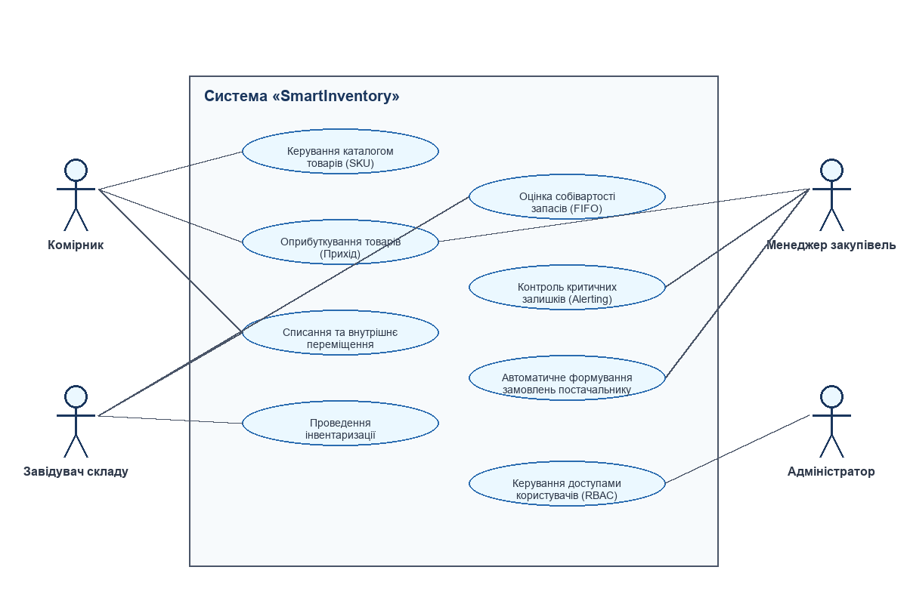
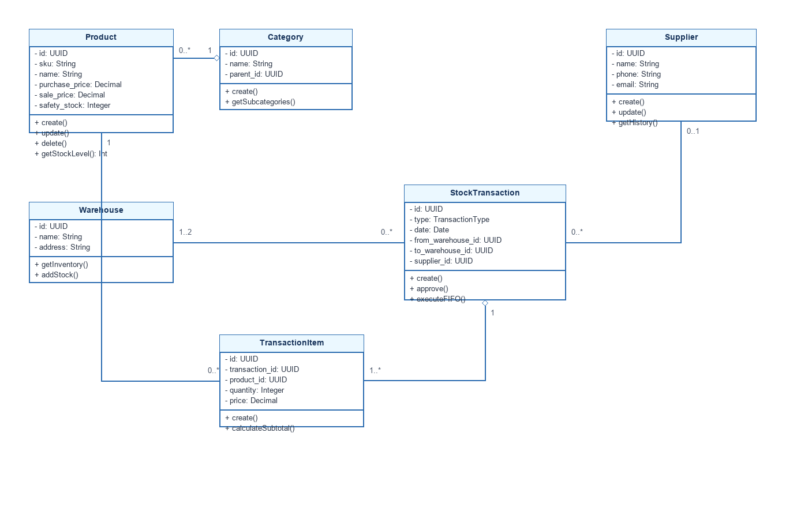
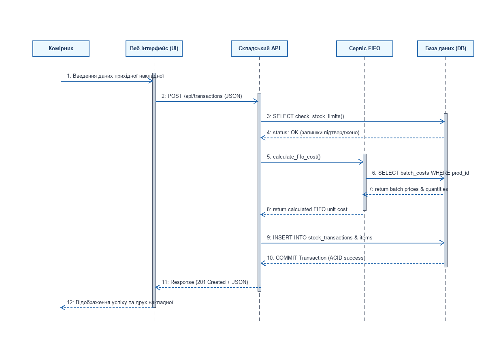
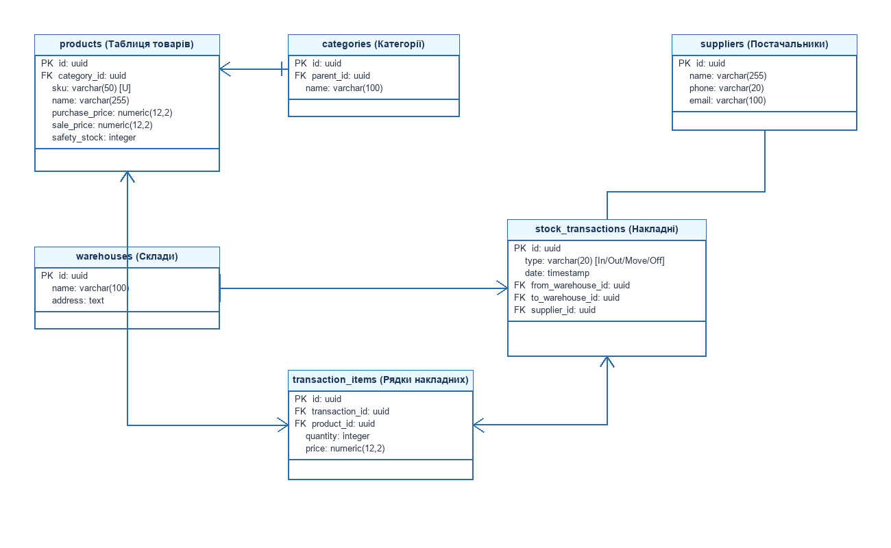

# Міністерство освіти і науки України
# Звіт з лабораторної роботи №2
**З дисципліни:** «Основи програмної інженерії» (ОПІ)  
**Тема:** Проєктування архітектури та структури ПЗ  
**Варіант №11:** Система управління запасами (Inventory Management System)  

---

## МЕТА
Формування практичних навичок проєктування архітектури програмного забезпечення, моделювання його структури та динаміки поведінки за допомогою мови моделювання UML (Unified Modeling Language), а також розробки логічної структури бази даних.

---

## ПОРЯДОК І ЗМІСТ ВИКОНАННЯ ЗАВДАНЬ

### ЗАВДАННЯ 1. ОБҐРУНТУВАННЯ АРХІТЕКТУРИ ПРОГРАМНОЇ СИСТЕМИ
Для розробки веб-системи управління запасами «SmartInventory» обрано класичну **триланкову архітектуру (Three-Tier Architecture)**, яка складається з наступних рівнів:
1. **Presentation Tier (Рівень представлення / Frontend):** Клієнтська частина системи, реалізована за допомогою фреймворку *React.js*, мови *TypeScript* та бібліотеки стилів *TailwindCSS*. Відповідає за відображення даних користувачу, взаємодію та валідацію введених даних безпосередньо у браузері.
2. **Application Tier (Рівень бізнес-логіки / Backend):** Серверна частина, побудована на платформі *Node.js* з використанням фреймворку *NestJS*. Цей рівень реалізує RESTful API ендпоінти, обробляє бізнес-правила складського обліку (включаючи розрахунок собівартості FIFO та контроль критичних залишків), здійснює авторизацію користувачів та логування дій.
3. **Data Tier (Рівень даних / Database):** Система керування базами даних *PostgreSQL*, яка забезпечує надійне збереження транзакцій, номенклатури, даних користувачів та контрагентів. СУБД гарантує транзакційну цілісність даних (відповідність принципам ACID).

**Переваги обраної архітектури:**
* **Незалежність рівнів:** Зміна інтерфейсу користувача не впливає на бізнес-логіку або структуру бази даних.
* **Масштабованість:** Можливість окремого масштабування серверної частини (наприклад, запуск кількох екземплярів API під балансувальником навантаження Nginx) та бази даних.
* **Безпека:** База даних ізольована від прямого доступу з мережі Інтернет; доступ до неї має виключно авторизований сервер бізнес-логіки.

---

### ЗАВДАННЯ 2. ПРОЄКТУВАННЯ ДІАГРАМИ ПРЕЦЕДЕНТІВ (UML USE CASE DIAGRAM)
Діаграма прецедентів визначає функціональні межі системи, дійових осіб (акторів) та їхні ролі у бізнес-процесах «SmartInventory».

В системі виділено 4 основні актори:
1. **Комірник:** здійснює операції фізичного руху товарів на складі (оприбуткування, переміщення, списання), працює з каталогом товарів.
2. **Завідувач складу:** контролює стан запасів підконтрольного складу, проводить інвентаризацію, виконує оцінку собівартості.
3. **Менеджер закупівель:** працює з базою постачальників, контролює дефіцит товарів, схвалює прибуткові накладні.
4. **Адміністратор:** керує обліковими записами користувачів, налаштовує ролі та права доступу (RBAC).

---

### ЗАВДАННЯ 3. ПРОЄКТУВАННЯ ДІАГРАМИ КЛАСІВ (UML CLASS DIAGRAM)
Діаграма класів описує статичну структуру системи: сутності предметної області, їхні атрибути, методи та взаємозв'язки між ними (асоціація, агрегація, залежність).

Основні класи системи:
* **Product:** Товарна одиниця (SKU), що містить штрих-код, ціни, артикул та ліміт безпечного залишку.
* **Category:** Категорія товарів з ієрархічним зв'язком (parent-child).
* **Warehouse:** Склад зберігання.
* **Supplier:** Постачальник товарів.
* **StockTransaction:** Документ руху запасів (Прихід, Витрата, Переміщення).
* **TransactionItem:** Рядок документа руху, що пов'язує транзакцію з товаром, кількістю та ціною закупівлі/продажу.

---

### ЗАВДАННЯ 4. ПРОЄКТУВАННЯ ДІАГРАМИ ПОСЛІДОВНОСТЕЙ (UML SEQUENCE DIAGRAM)
Діаграма послідовностей моделює динамічну поведінку системи на прикладі критичного бізнес-процесу: **«Оприбуткування прихідної накладної комірником»**. Вона деталізує обмін повідомленнями між користувачем, веб-інтерфейсом, API, сервісом розрахунку FIFO та базою даних.

Діаграма демонструє наступний ланцюжок взаємодій:
1. Комірник заповнює форму приходу товару в UI та підтверджує проведення накладної.
2. Веб-інтерфейс надсилає HTTP POST запит на складський API.
3. API виконує процедуру перевірки лімітів складу у базі даних (DB).
4. API звертається до Сервісу FIFO для розрахунку собівартості партії на основі цін попередніх партій.
5. Сервіс FIFO зчитує ціни попередніх партій з БД та обчислює інтегральну вартість.
6. Дані транзакції зберігаються в БД в межах єдиної транзакції (COMMIT).
7. Веб-інтерфейс отримує відповідь 201 Created та відображає комірнику успішний результат операції з можливістю друку накладної.

---

### ЗАВДАННЯ 5. ПРОЄКТУВАННЯ СТРУКТУРИ БАЗИ ДАНИХ (ER-DIAGRAM)
Entity-Relationship Diagram (ERD) відображає логічну структуру бази даних PostgreSQL, типи даних полів, первинні (PK) та зовнішні (FK) ключі, а також кардинальність зв'язків між таблицями (1-to-many, many-to-many).

Схема складається з 6 основних таблиць:
* `products` – таблиця товарних карток (зв'язана з `categories` як Many-to-1).
* `categories` – ієрархічна таблиця категорій (зв'язана сама з собою рекурсивним зв'язком `parent_id`).
* `warehouses` – склади зберігання.
* `suppliers` – контрагенти-постачальники.
* `stock_transactions` – шапка документів руху товарів.
* `transaction_items` – таблиця специфікацій (рядків) документів руху, яка реалізує зв'язок Many-to-Many між таблицями `products` та `stock_transactions`.

---

## ВИСНОВОК
Під час виконання лабораторної роботи №2 було успішно спроєктовано архітектуру та внутрішню структуру системи управління запасами «SmartInventory». Використання мови моделювання UML дозволило побудувати наочні графічні моделі функціоналу системи (Use Case Diagram), її статичної структури (Class Diagram) та динаміки взаємодії компонентів (Sequence Diagram). Розроблена ER-діаграма є основою для подальшого фізичного створення реляційної бази даних у СКБД PostgreSQL.

---
**Звіт підготував:**  
Студент курсу «Основи програмної інженерії»  
*(Підпис, Дата)*
