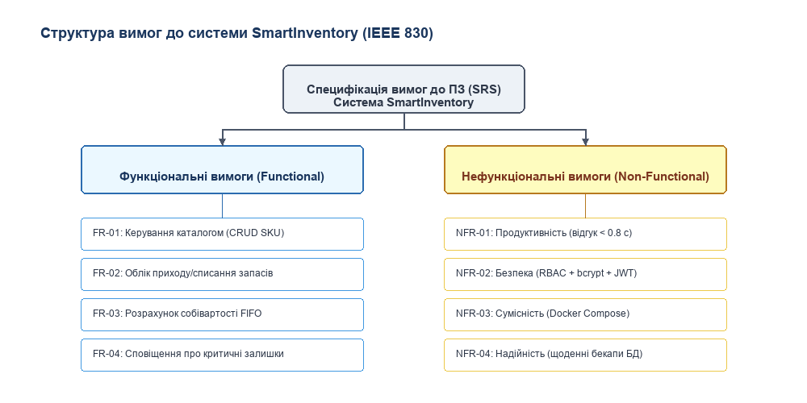
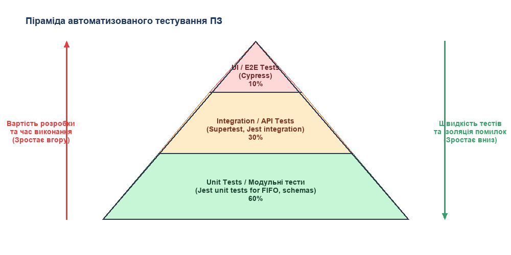
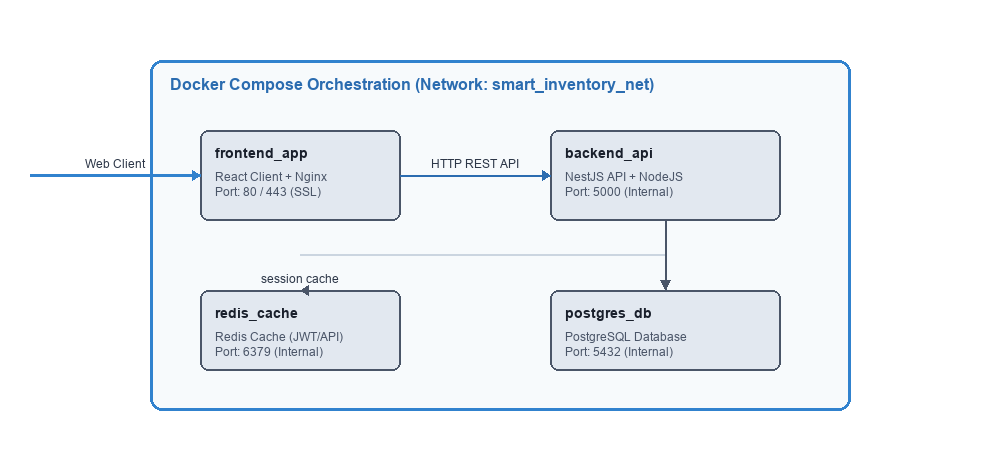
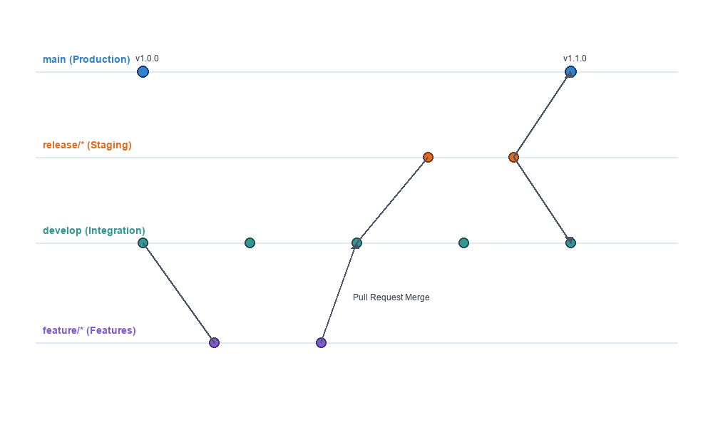
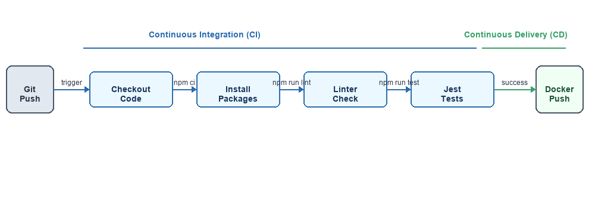
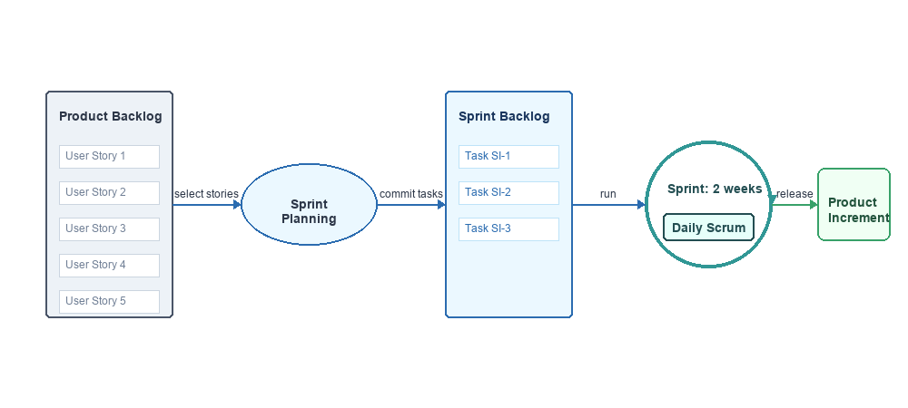
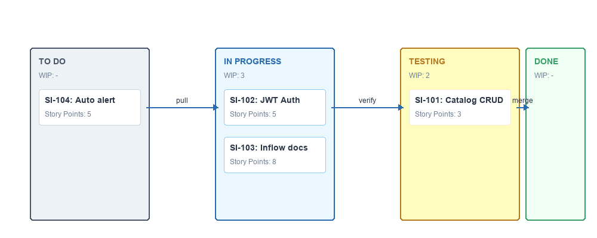
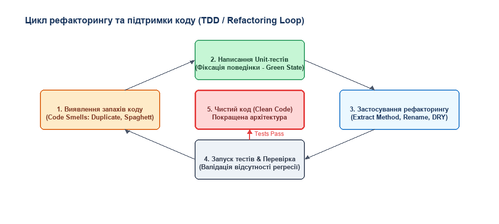

# ПРАКТИЧНИЙ ПОСІБНИК З ВИКОНАННЯ ЗАВДАНЬ
## Покрокові інструкції роботи з UML, SRS, Jest, Docker, Git, CI/CD, Jira та Refactoring
**Дисципліна:** Основи програмної інженерії (ОПІ)  
**Розробник:** Ярослав ДОБЖАНСЬКИЙ, ст. гр. КН-24-1  
**Проєкт:** Система управління запасами «SmartInventory» (Варіант №11)  

---

## ВСТУП
Цей посібник містить вичерпні, покрокові інструкції, команди та скріншот-орієнтири для практичного виконання завдань лабораторних робіт №2-9 на реальних платформах: **Draw.io/PlantUML**, **Markdown (SRS)**, **Jest (Testing)**, **Docker Desktop**, **GitHub**, **GitHub Actions**, **Jira Software** та **ESLint (Clean Code)**. Дотримуючись цих інструкцій, ви зможете за 10 хвилин розгорнути та продемонструвати викладачу повністю робочу інфраструктуру проєкту.

---

## 1. ПОКРОКОВА ІНСТРУКЦІЯ З UML-ПРОЄКТУВАННЯ (Для ЛР №2)

UML-моделювання є основою проектування архітектури системи «SmartInventory». Для побудови діаграм рекомендується використовувати безкоштовний інструмент **Draw.io** (desktop або web-версія) або інструмент генерації з коду **PlantUML**.

#### Крок 1.1. Створення UML Use Case діаграми в Draw.io
1. Перейдіть на [draw.io](https://app.diagrams.net/).
2. Оберіть створення порожньої діаграми.
3. У лівій панелі відкрийте вкладку **UML** та перетягніть на робочу область фігури **Actor** (Актор) та **Use Case** (Прецедент - овал).
4. Налаштуйте 4 ролі користувачів:
   * *Комірник:* асоціюється з керуванням каталогом товарів (SKU), оприбуткуванням та списанням.
   * *Завідувач складу:* асоціюється зі списанням, проведенням інвентаризації та переглядом оцінки FIFO.
   * *Менеджер закупівель:* асоціюється з оприбуткуванням, контролем критичних залишків та авто-замовленнями.
   * *Адміністратор:* асоціюється з налаштуванням доступів (RBAC).
5. З'єднайте акторів та прецеденти лініями зв'язку (**Association**).


#### Крок 1.2. Побудова діаграми класів (Class Diagram)
1. Додайте на робочу область Draw.io елементи **Class** (трисекційні прямокутники).
2. Заповніть секції:
   * *Верхня:* Назва класу (`Product`, `Category`, `Warehouse`, `StockTransaction`, `TransactionItem`, `Supplier`).
   * *Середня (Атрибути):* Вкажіть типи даних (наприклад, `- id: UUID`, `- purchase_price: Decimal`).
   * *Нижня (Методи):* Додайте поведінкові функції (наприклад, `+ getStockLevel(): Int`, `+ executeFIFO()`).
3. Налаштуйте зв'язки між класами (асоціація, агрегація, композиція) та вкажіть кратність зв'язків (наприклад, 1 до `0..*`).


#### Крок 1.3. Моделювання процесу проведення накладної (Sequence Diagram)
1. Додайте об'єкти Lifeline (Лінії життя) для актора та критичних компонентів системи: `Комірник`, `UI`, `API`, `FIFO Service`, `Database`.
2. Намалюйте стрілки повідомлень (синхронних та асинхронних викликів) згори донизу:
   * `Введення накладної` -> `UI`
   * `POST /api/transactions` -> `API`
   * `SELECT check_stock_limits()` -> `DB`
   * `calculate_fifo_cost()` -> `FIFO Service`
   * `COMMIT` -> `DB`


#### Крок 1.4. Проєктування схеми бази даних (Entity-Relationship Diagram)
1. Намалюйте фізичну ER-діаграму для PostgreSQL, використовуючи таблиці з первинними (PK) та зовнішніми (FK) ключами.
2. Відобразіть зв'язки типу **One-to-Many** (Один-до-багатьох) від категорій та складів до товарів і накладних.
3. Сполучна таблиця `transaction_items` повинна зв'язувати товари (`products`) та документи (`stock_transactions`).


---

## 2. ПОКРОКОВА ІНСТРУКЦІЯ З СПЕЦИФІКАЦІЇ ВИМОГ (Для ЛР №3)

Лабораторна робота №3 присвячена деталізації вимог до системи за стандартом **IEEE 830-1998**.

#### Крок 2.1. Структурування вимог до системи
1. Створіть специфікацію вимог до програмного забезпечення (SRS) у форматі Markdown.
2. Розділіть вимоги на дві ключові категорії:
   * *Функціональні вимоги (FR):* Що система повинна робити (CRUD, FIFO облік, сповіщення).
   * *Нефункціональні вимоги (NFR):* Якість роботи (швидкість відгуку < 0.8 с, безпека JWT, Docker-сумісність).



#### Крок 2.2. Написання прецедентів та сценаріїв
Для критичних функцій (наприклад, списання товару) опишіть детальний сценарій:
* **Основний потік (Main Flow):** Користувач створює документ списання -> вказує товари та кількість -> система перевіряє залишок -> оновлює базу даних -> виводить повідомлення про успіх.
* **Альтернативний потік (Alternative Flow):** Якщо кількість товару на складі менша за запитувану -> система блокує проведення транзакції -> виводить повідомлення про помилку валідації.

---

## 3. ПОКРОКОВА ІНСТРУКЦІЯ З НАЛАШТУВАННЯ ТЕСТУВАННЯ В JEST (Для ЛР №4)

Для автоматизації тестування логіки FIFO (First-In, First-Out) використовується фреймворк модульного тестування **Jest**.

#### Крок 3.1. Структура тестів
Тестування проєкту будується відповідно до класичної піраміди тестування:
1. *Unit Tests (Модульні):* Перевіряють окремі функції розрахунку FIFO вартості.
2. *Integration Tests (Інтеграційні):* Перевіряють взаємодію API з базою даних PostgreSQL.
3. *E2E / UI Tests (Наскрізні):* Симулюють поведінку користувача в інтерфейсі React.



#### Крок 3.2. Ініціалізація Jest та написання тесту FIFO
1. Встановіть Jest у вашому проєкті:
   ```bash
   npm install --save-dev jest
   ```
2. Створіть файл реалізації FIFO `fifo.js` та тест до нього `tests/fifo.test.js`.
3. Додайте код тесту, який перевіряє правильність списання партій (спочатку списуються товари з ранішою датою закупівлі):
   ```javascript
   const { calculateFIFO } = require('../fifo');

   test('FIFO Calculation: should deduct from oldest batches first', () => {
       const batches = [
           { id: 1, qty: 10, price: 100 }, // найстаріша партія
           { id: 2, qty: 5, price: 120 }
       ];
       const result = calculateFIFO(batches, 12); // Списуємо 12 одиниць
       
       expect(result.totalCost).toBe(1240); // 10*100 + 2*120 = 1240
       expect(result.remainingBatches[0].qty).toBe(0);
       expect(result.remainingBatches[1].qty).toBe(3);
   });
   ```

#### Крок 3.3. Запуск тестів
Запустіть виконання тестів через консоль:
```bash
npm run test
```
Ви повинні побачити звіт із зеленим статусом `PASS tests/fifo.test.js`.

---

## 4. ПОКРОКОВА ІНСТРУКЦІЯ З РОЗГОРТАННЯ В DOCKER (Для ЛР №5)

Для забезпечення однакового робочого середовища розробника та сервера використовується Docker Compose.

#### Крок 4.1. Створення файлу оркестрації
У коліні вашого проєкту створіть файл `docker-compose.yml`, який описує чотири взаємопов'язані сервіси:
1. `frontend_app` (React на Nginx).
2. `backend_api` (NestJS).
3. `postgres_db` (База даних PostgreSQL).
4. `redis_cache` (Кеш сесій та залишків).

#### Крок 4.2. Запуск та перевірка працездатності
1. Відкрийте термінал у папці з `docker-compose.yml` та запустіть оркестрацію:
   ```bash
   docker compose up -d
   ```
2. Перевірте статус запущених контейнерів:
   ```bash
   docker compose ps
   ```
3. Тепер додаток SmartInventory доступний за адресою `http://localhost`.



#### Крок 4.3. Налаштування резервного копіювання БД
Для автоматичного створення бекапів бази даних у контейнері PostgreSQL додайте cron-скрипт `backup.sh`:
```bash
#!/bin/bash
BACKUP_DIR="./backups"
TIMESTAMP=$(date +"%Y%m%d_%H%M%S")
docker compose exec -t postgres_db pg_dumpall -U postgres | gzip > $BACKUP_DIR/db_backup_$TIMESTAMP.sql.gz
find $BACKUP_DIR -type f -mtime +30 -delete # Видаляти старіші за 30 днів
```

---

## 5. ПОКРОКОВА ІНСТРУКЦІЯ З РОБОТИ В GITHUB (Для ЛР №6)

Контроль версій є обов'язковим для спільної розробки ПЗ. Проєкт ведеться відповідно до стандарту GitFlow.

#### Крок 5.1. Створення репозиторію та перший коміт
1. Створіть публічний репозиторій `smart-inventory` на GitHub.
2. Виконайте ініціалізацію локально:
   ```bash
   git init
   git add .
   git commit -m "feat: ініціалізація проєкту SmartInventory, додано ТЗ"
   git remote add origin https://github.com/username/smart-inventory.git
   git branch -M main
   git push -u origin main
   ```

#### Крок 5.2. Реалізація моделі GitFlow
1. Створіть гілку для інтеграції розробки `develop`:
   ```bash
   git checkout -b develop
   git push -u origin develop
   ```
2. Для розробки кожної нової функції створюйте окрему гілку `feature/*`:
   ```bash
   git checkout -b feature/catalog-import
   # (Внесення змін у код)
   git add .
   git commit -m "feat: реалізовано імпорт та оприбуткування SKU"
   git push -u origin feature/catalog-import
   ```



#### Крок 5.3. Створення Pull Request та злиття
1. Перейдіть на GitHub та створіть Pull Request з гілки `feature/catalog-import` в `develop`.
2. Після схвалення (та зелених тестів) злийте зміни через **Merge pull request**.
3. Для випуску релізу злийте `develop` в `main` та додайте тег SemVer:
   ```bash
   git checkout main
   git merge develop
   git tag -a v1.0.0 -m "Реліз версії v1.0.0"
   git push origin v1.0.0
   ```

---

## 6. ПОКРОКОВА ІНСТРУКЦІЯ З НАЛАШТУВАННЯ GITHUB ACTIONS CI/CD (Для ЛР №7)

Для автоматизації перевірки якості коду використовується GitHub Actions.

#### Крок 6.1. Створення workflows-файлу
Створіть файл `.github/workflows/ci.yml` у репозиторії:
```yaml
name: SmartInventory Continuous Integration (CI)
on:
  push:
    branches: [ main, develop ]
  pull_request:
    branches: [ main, develop ]
jobs:
  build-and-test:
    runs-on: ubuntu-latest
    steps:
      - uses: actions/checkout@v3
      - name: Use Node.js
        uses: actions/setup-node@v3
        with:
          node-size: 18.x
      - run: npm ci
      - run: npm run lint
      - run: npm run test
```

#### Крок 6.2. Моніторинг конвеєра CI
Після кожного `git push` переходьте у вкладку **«Actions»** на GitHub, щоб спостерігати за автоматичним проходженням лінтера та тестів. Якщо всі кроки позначені зеленими галочками — інтеграція успішна!



---

## 7. ПОКРОКОВА ІНСТРУКЦІЯ З РОБОТИ В JIRA SOFTWARE (Для ЛР №8)

Jira Software використовується для планування завдань за гнучкою методологією Scrum.

#### Крок 7.1. Створення проєкту Scrum
1. Створіть Scrum-проєкт у хмарі Jira.
2. Сформуйте структуру релізів та життєвого циклу розробки.



#### Крок 7.2. Беклог, Story Points та Спринт
1. У вкладці **«Backlog»** створіть User Stories (наприклад, `US-001: Автоматичне сповіщення про критичний залишок`).
2. Встановіть оцінки складності в **Story Points** (наприклад, 5 SP).
3. Створіть `Sprint 1`, перетягніть туди картки та натисніть **«Start Sprint»** (тривалість 2 тижні).
4. Переміщуйте картки на інтерактивній дошці з **To Do** в **In Progress** та **Done**.



---

## 8. ПОКРОКОВА ІНСТРУКЦІЯ З РЕФАКТОРИНГУ ТА ПІДТРИМКИ (Для ЛР №9)

Рефакторинг — це покращення внутрішньої структури коду без зміни його зовнішньої поведінки.

#### Крок 8.1. Виявлення запахів коду (Code Smells)
Використовуйте ESLint для автоматичного виявлення проблемних місць коду:
```bash
npm run lint
```
Основні виявлені дефекти:
* **Duplicate Code:** Однакова логіка розрахунку податків у різних файлах.
* **Long Method:** Метод проведення транзакції на 150 рядків коду.

#### Крок 8.2. Цикл рефакторингу
Процес рефакторингу виконується ітераційно за циклом Red-Green-Refactor, забезпечуючи відсутність регресії за допомогою Jest-тестів.



#### Крок 8.3. Застосування технік рефакторингу
Застосуйте техніку **Extract Method** (Виділення методу) для скорочення довгих функцій:
```javascript
// ДО РЕФАКТОРИНГУ:
function processInvoice(transaction) {
    // ... 50 рядків валідації ...
    // ... 50 рядків розрахунку податку ...
}

// ПІСЛЯ РЕФАКТОРИНГУ:
function validateTransaction(t) { /* ... */ }
function calculateTaxes(t) { /* ... */ }

function processInvoice(transaction) {
    validateTransaction(transaction);
    const tax = calculateTaxes(transaction);
}
```
Після змін обов'язково запустіть `npm run test` для підтвердження успішного рефакторингу!

#### Крок 8.4. Оформлення Bug Report
При знаходженні помилок під час тестування або підтримки ПЗ, зафіксуйте їх у Jira/Markdown за шаблоном:
* **ID:** BUG-011
* **Title:** Помилка ділення на нуль при списанні порожньої партії товарів
* **Steps to Reproduce:** Створити списання -> кількість = 0 -> провести.
* **Expected Result:** Блокування операції та виведення повідомлення про некоректну кількість.
* **Actual Result:** Збій сервера `Crash: ZeroDivisionError`.
